# Esprit Education Management System

A full-stack education management platform built with Next.js, TypeScript, and Supabase, featuring robust role-based access (Teacher/Admin), modern UI, Excel/PDF imports, and secure authentication.

> Internship project at Esprit University by Sayari Mohamed Amin. Encadrant: Ghassen Klai.

## ✨ Highlights

- Modern Next.js 15 + React 19 app with Tailwind CSS 4
- Clean Architecture (Domain, Application, Infrastructure, Presentation)
- JWT authentication with secure `auth_token` cookies
- Teacher and Admin roles with protected API routes and UI
- Students, Teachers, Classes, Subjects, Notes, Schedules modules
- Excel import/export for students and grades
- PDF schedule extraction (Python `pdfplumber`)
- Email-based password reset with verification codes (Gmail)
- Supabase as the database/storage layer

## 🧱 Tech Stack

- Framework: Next.js 15, React 19, TypeScript 5
- Styling: Tailwind CSS 4
- Auth: jose (JWT), httpOnly cookies
- DB/Storage: Supabase (`@supabase/supabase/supabase-js`)
- Email: Nodemailer (Gmail App Password)
- Files: Multer-like FormData handling in Next API routes
- Data import: `xlsx`
- Schedules: PDF parsing via Python (`pdfplumber`) executed from Node

## 🔐 Roles & Access

### 👨‍🏫 Teacher Role
- **Classroom Management**: View and manage assigned classes, add new class assignments
- **Student Management**: View and manage students in assigned classes
- **Notes Management**: Enter, update, and manage grades (CC, TP, DV) for assigned subjects
- **Schedule Management**: View and manage schedules, create new schedule entries
- **Employment Management**: Manage workload distribution and schedule PDF imports
- **PFE Management**: Create and manage final year projects (soutenances)
- **Profile Management**: Update profile photo and personal information
- **Data Import/Export**: Import student data from Excel, export grades to CSV

### 👨‍💼 Admin Role
- **All Teacher Features**: Complete access to all teacher functionality
- **System Administration**:
  - Manage all students across the entire system
  - Manage all teachers and their roles (teacher/admin)
  - Manage all classes and their configurations
  - Manage all subjects and their coefficients
  - Import/export students and grades system-wide
  - Access comprehensive system statistics and analytics
- **Role Management**: Update teacher roles between 'teacher' and 'admin'
- **Global Data Management**: Full CRUD operations on all system entities

### 🔒 Access Control
- **Route Protection**: Middleware-based authentication with JWT tokens
- **Role-Based Navigation**: Dynamic sidebar showing only relevant features per role
- **API Security**: `withAuth` for authenticated routes, `withAdminAuth` for admin-only endpoints
- **Component Guards**: `RoleGuard` component protecting UI elements by role
- **Department-Based Access**: Additional access for users in 'admin' or 'direction' departments

## 🖼️ Application Screenshots

### 🌟 Public Pages

<div align="center">
  <h3>🏠 Homepage</h3>
  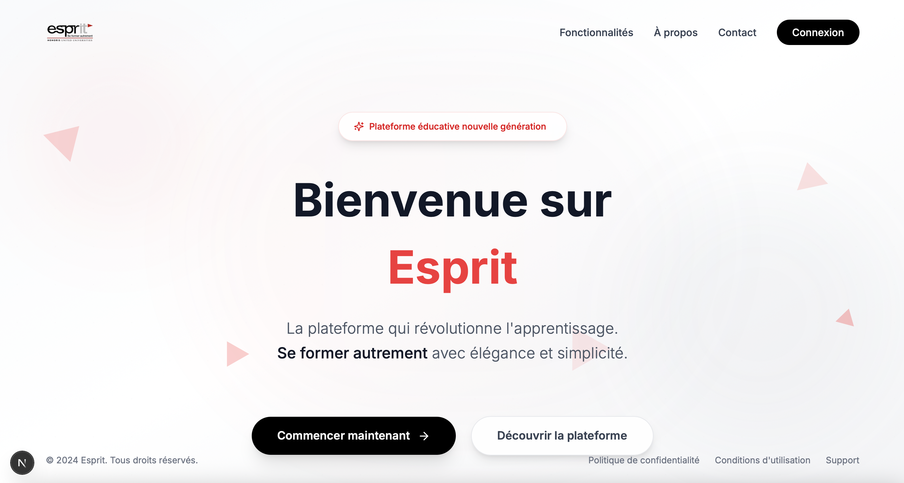
  
  <h3>🔐 Login Page</h3>
  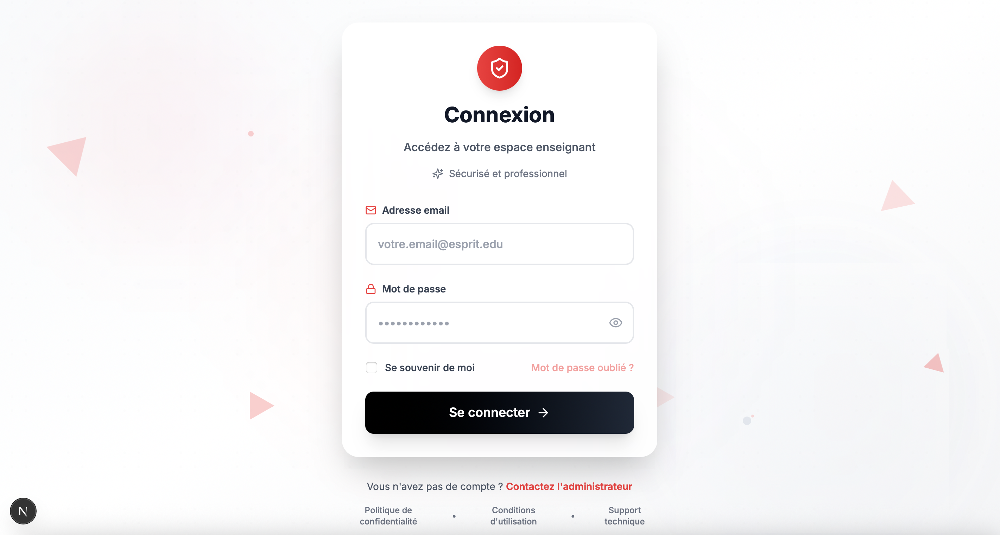
</div>

### 👨‍🏫 Teacher Dashboard

<div align="center">
  <h3>📚 Classroom Management</h3>
  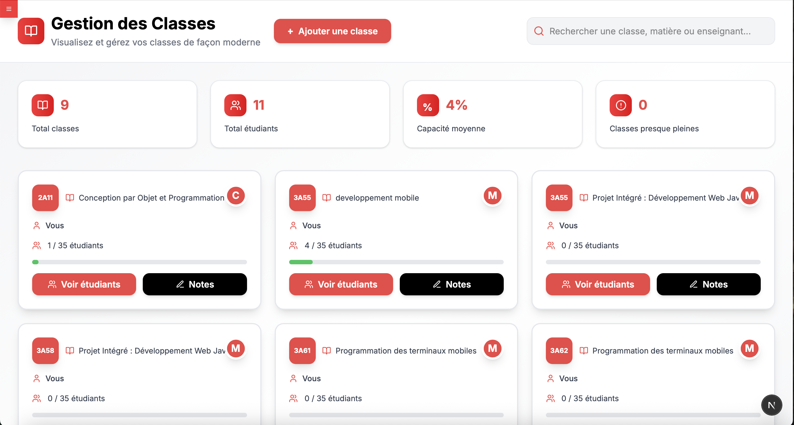
  
  <h3>📝 Notes Management</h3>
  
  
  <h3>📅 Schedule Management</h3>
  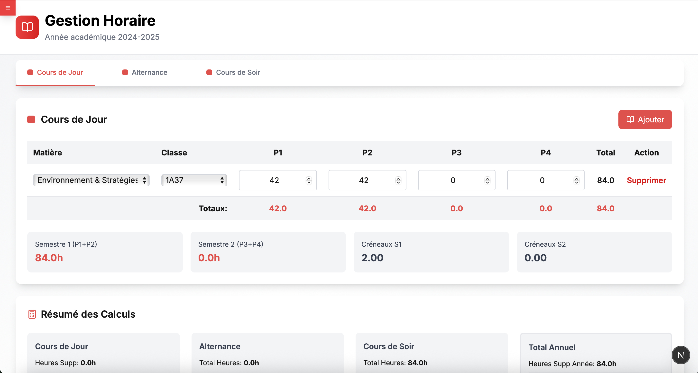
  
  <h3>📊 Employment Management</h3>
  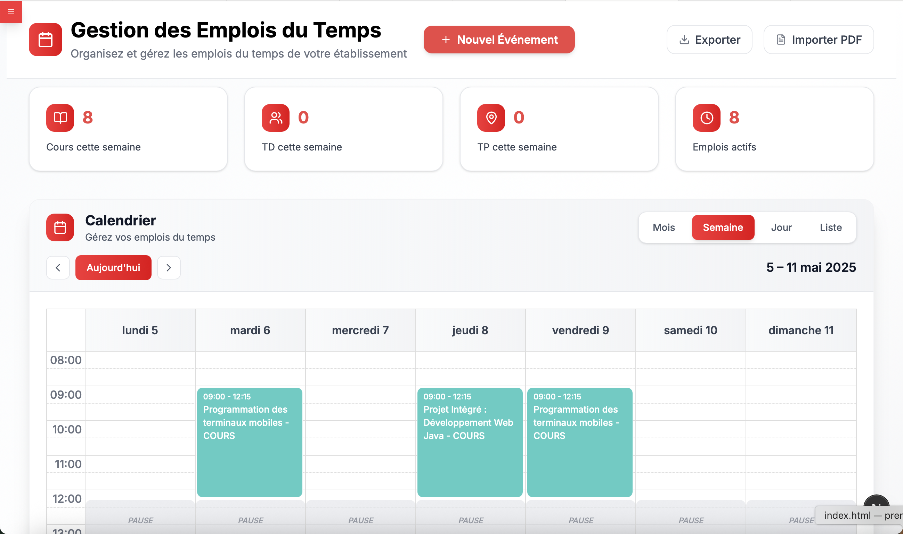
  
  <h3>🎓 PFE Management</h3>
  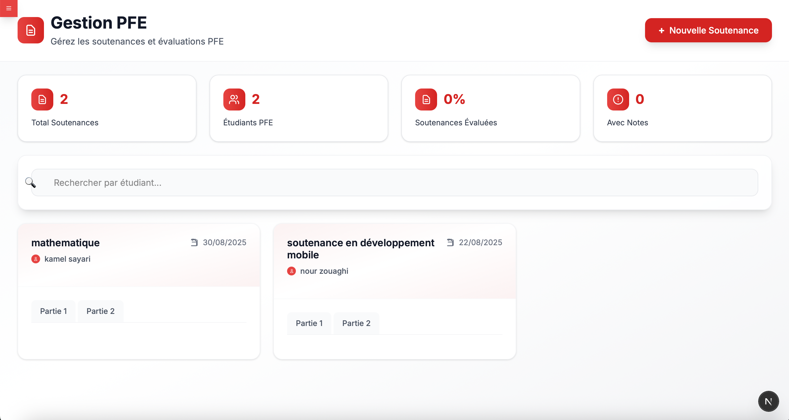
  
  <h3>👥 Student Management</h3>
  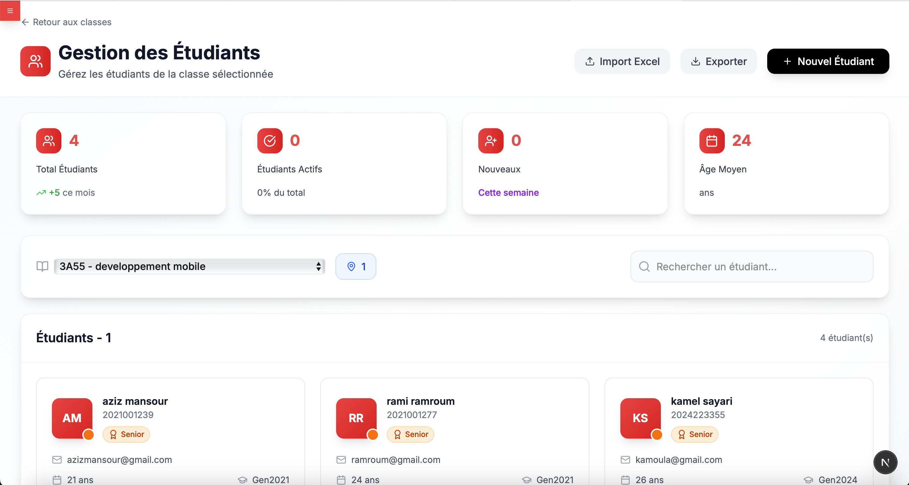
  
  <h3>👤 Profile Page</h3>
  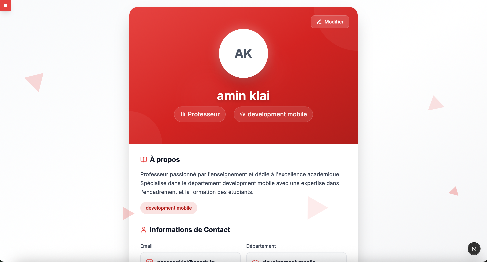
  
  <h3>🧭 Teacher Navigation</h3>
  
</div>

### 👨‍💼 Admin Dashboard

<div align="center">
  <h3>🏢 Class Management</h3>
  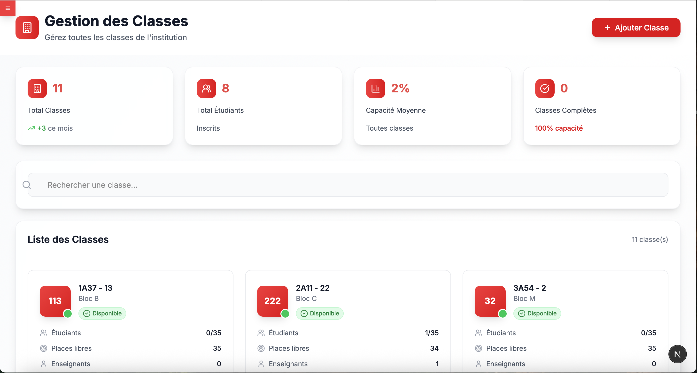
  
  <h3>👨‍🏫 Teacher Management</h3>
  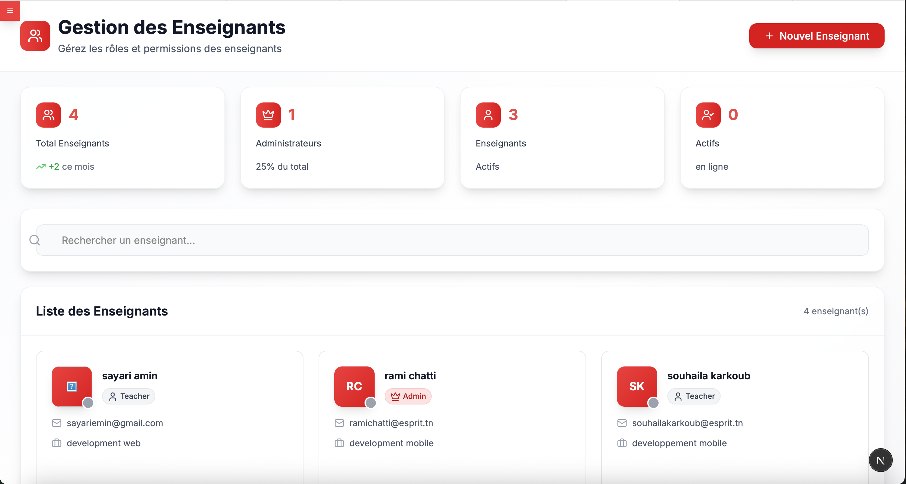
  
  <h3>📚 Subject Management</h3>
  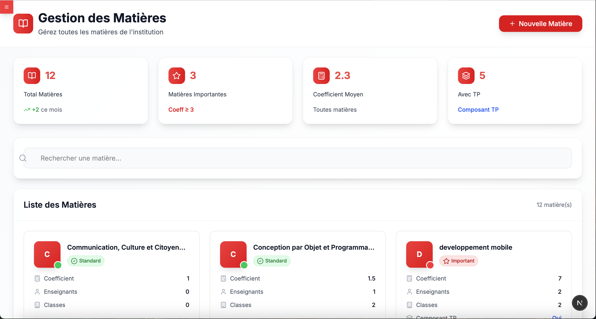
  
  <h3>👥 Student Management (Admin)</h3>
  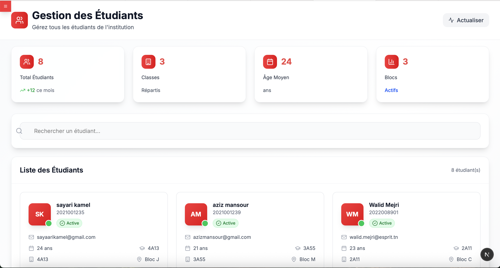
  
  <h3>🧭 Admin Navigation</h3>
  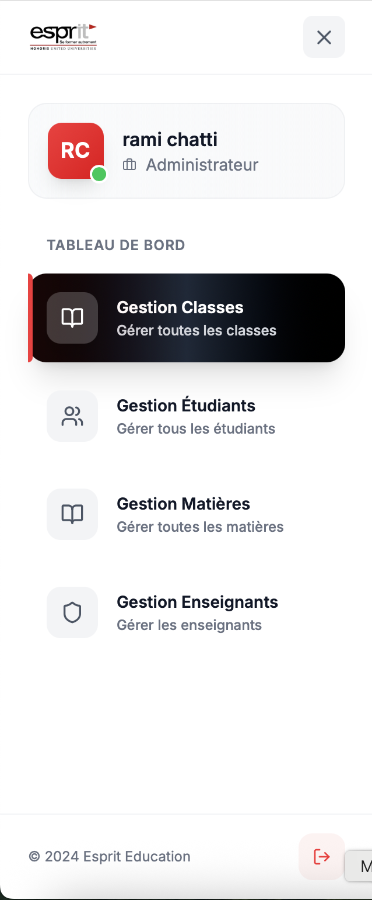
</div>

### 🔧 Import/Export Features

<div align="center">
  <h3>📊 Excel Import - Students</h3>
  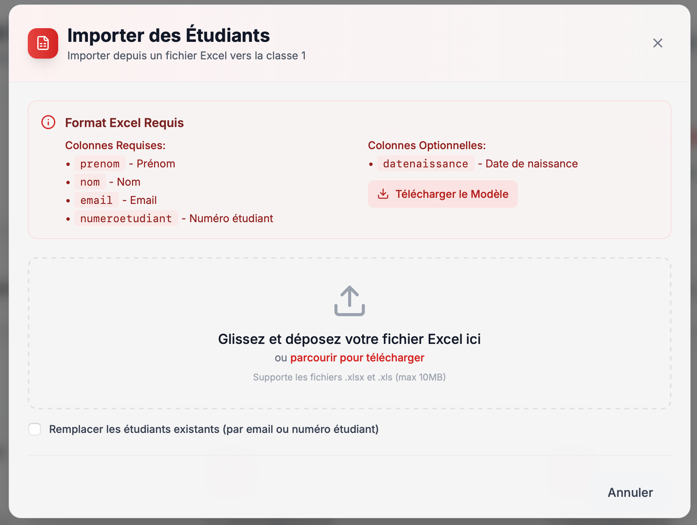
  
  <h3>📄 PDF Import - Schedules</h3>
  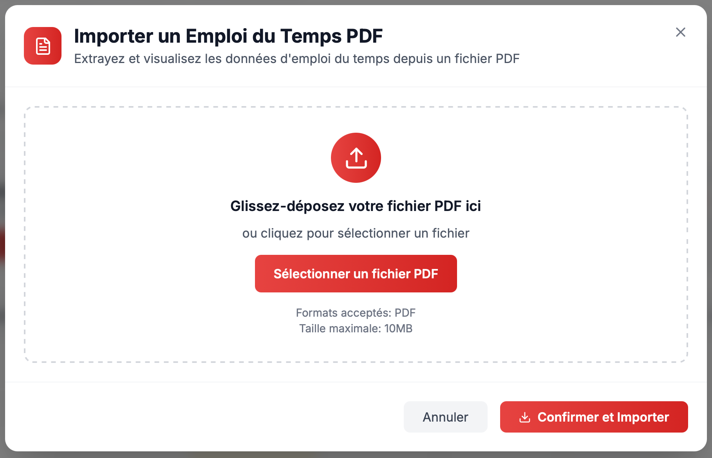
</div>

---

## ⚙️ Environment Variables

Create `.env.local` from the example below (or run: `cp .env.example .env.local`).

```bash
# Supabase
SUPABASE_URL="https://YOUR-PROJECT.supabase.co"
SUPABASE_KEY="YOUR_SERVICE_ROLE_OR_ANON_KEY"

# JWT
JWT_SECRET="change_me_in_production"

# Gmail (App Password required)
GMAIL_USER="your.address@gmail.com"
GMAIL_APP_PASSWORD="your_gmail_app_password"
```

Notes:
- `SUPABASE_KEY`: Prefer a restricted service role for server-side operations.
- JWT is used for signing/validating tokens (`src/infrastructure/services/JwtTokenService.ts`).

## 🚀 Getting Started

1) Install dependencies

```bash
npm install
```

2) Set up environment

```bash
cp .env.example .env.local
# Fill in values for Supabase, JWT, Gmail
```

3) (Optional) Set up Python virtualenv for PDF import

```bash
python3 -m venv venv
./venv/bin/pip install -r requirements.txt
# The app runs the script via ./venv/bin/python3 extract_schedule.py
```

4) Run the dev server

```bash
npm run dev
```

App will be available at http://localhost:3000

## 📦 NPM Scripts

- `npm run dev` - Start development server (Turbopack)
- `npm run build` - Build for production
- `npm run start` - Start production server
- `npm run lint` - ESLint

## 🧭 App Structure (Clean Architecture)

- `src/core` - Entities, value objects, and interfaces
- `src/application` - Use-cases and DTOs
- `src/infrastructure` - Supabase config, repositories, services (JWT, Email, Excel/PDF)
- `src/presentation` - UI components, pages, hooks
- `app` - Next.js App Router (UI routes and API routes)

## 🗄️ Database Model (Supabase)

### 👨‍🏫 Core Entities

#### **Teacher** (`teacher`)
- **Primary Fields**: `id`, `firstname`, `lastname`, `email` (unique), `departement`, `hashedPassword`, `photoUrl`, `role` ('teacher'|'admin')
- **Business Rules**: Email validation, role validation, department-based admin access
- **Features**: Profile photo management, role-based permissions, department-specific access

#### **Student** (`etudiant`) 
- **Primary Fields**: `id`, `firstname`, `lastname`, `email` (unique), `classeId`, `numeroEtudiant` (unique), `dateNaissance`
- **Business Rules**: Age validation (16+), student number format (YYYY + sequence), email validation
- **Features**: Academic year tracking, generation identification, status classification

#### **Class** (`classe`)
- **Primary Fields**: `id`, `nomClasse`, `bloc`, `numclasse`, `nbreEtudiantMax`, `nbreEtudiantActuel`
- **Business Rules**: Capacity validation, student count limits, class level classification
- **Features**: Capacity monitoring, status tracking (empty/low/medium/high/full)

#### **Subject** (`matiere`)
- **Primary Fields**: `id`, `nommatiere`, `description`, `coefficient`
- **Business Rules**: Coefficient range (0.1-10.0), name length limits, description validation
- **Features**: Subject type classification, priority assessment, weighted importance

### 🔗 Relationship Entities

#### **Teacher-Class-Subject** (`teacher_classe`)
- **Purpose**: Many-to-many relationship between teachers, classes, and subjects
- **Fields**: `id`, `teacherId`, `classeId`, `matiereId`
- **Business Rules**: Valid assignment validation, unique teaching context identification

#### **Teacher Workload** (`teacher_workload`)
- **Purpose**: Track teacher hours across different shift types and periods
- **Fields**: `teacherId`, `matiereId`, `classeId`, `shiftType`, `period`, `hours`, `academicYear`
- **Shift Types**: `cours_de_jour`, `alternance`, `cours_de_soir`
- **Periods**: `P1`, `P2`, `P3`, `P4` (semester-based)

### 📊 Academic Management

#### **Notes System**
- **NoteFinale** (`note_finale`): `id`, `etudiantId`, `matiereId`, `teacherId`, `noteCC`, `noteTP`, `noteDV`, `noteFinale`
- **NoteConfig** (`note_config`): `id`, `matiereId`, `pourcentageCC`, `pourcentageTP`, `pourcentageDV`
- **Business Rules**: Grade validation (0-20), percentage validation (total = 100%), TP component optional
- **Features**: Final grade calculation, completion tracking, grade letter conversion

#### **Schedule Management** (`schedule`)
- **Primary Fields**: `id`, `teacherId`, `matiereId`, `classeId`, `scheduleDate`, `weekStartDate`, `startTime`, `endTime`, `sessionType`, `notes`, `isCancelled`
- **Session Types**: `cours`, `td`, `tp`, `exam`
- **Business Rules**: Time validation, overlap detection, past scheduling prevention
- **Features**: Duration calculation, week-based organization, cancellation tracking

### 🎓 PFE (Final Year Projects)

#### **Soutenance System**
- **Soutenance** (`soutenance`): `id`, `etudiantId`, `teacherId`, `dateSoutenance`, `sujet`
- **SoutenancePart** (`soutenance_part`): Project component management
- **SoutenanceNote** (`soutenance_note`): Evaluation and grading system

### 🔐 Authentication & Security

#### **Password Reset** (`password_reset_tokens`)
- **Fields**: `id`, `email`, `code`, `expiresAt`, `isUsed`, `createdAt`
- **Business Rules**: 15-minute expiration, single-use validation, email verification

#### **AuthToken** (`auth_token`)
- **Purpose**: JWT-based session management
- **Features**: Role-based access, expiration tracking, refresh capabilities

### 🏗️ Architecture Features

- **Value Objects**: `Email`, `Password`, `StudentNumber`, `Grade` with validation
- **Business Rules**: Comprehensive validation at entity level
- **Factory Methods**: Immutable entity creation and updates
- **Repository Pattern**: Supabase-based data access layer
- **Domain-Driven Design**: Rich domain models with business logic encapsulation

> **Database**: Supabase (PostgreSQL) with TypeScript entities and value objects
> **Implementation**: Clean Architecture with domain entities, application use cases, and infrastructure repositories

## 🔒 Security

- JWT auth with httpOnly cookies (`auth_token`)
- Middleware-protected routes (`middleware.ts` + `withAuth`/`withAdminAuth`)
- Strong password hashing (bcryptjs)
- DTO-based validation at API boundaries
- Parameterized queries via Supabase client

## 🔑 Authentication Flow

- Login: `POST /api/auth/login` → issues JWT, sets `auth_token` cookie (24h or 30d with remember me)
- Validate: `GET|POST /api/auth/validate` → validates token and returns teacher info
- Logout: `POST /api/auth/logout` → clears cookie
- Forgot Password: `POST /api/auth/forgot-password` → sends code by email
- Verify Reset Code: `POST /api/auth/verify-reset-code`
- Reset Password: `POST /api/auth/reset-password`

## 📚 API Endpoints (Implemented)

### 🔐 Authentication
- `POST /api/auth/login` - User login with JWT token generation
- `GET /api/auth/validate` - Validate token from cookies (browser)
- `POST /api/auth/validate` - Validate token from request body (API)
- `POST /api/auth/logout` - Clear authentication cookie
- `POST /api/auth/forgot-password` - Send password reset code via email
- `POST /api/auth/verify-reset-code` - Verify password reset code
- `POST /api/auth/reset-password` - Reset password with verified code
- `GET /api/auth/me` - Get current authenticated user info

### 👨‍🏫 Teachers Management
- `GET /api/teachers` (auth) - Get all teachers
- `POST /api/teachers` (auth) - Create new teacher (optional `role`)
- `PUT /api/teachers/update` (auth) - Update teacher profile
- `POST /api/teachers/update-role` (admin) - Change teacher role
- `POST /api/teachers/upload-photo` (auth) - Upload profile photo
- `GET /api/teachers/classes` (auth) - Get teacher's assigned classes
- `POST /api/teachers/by-ids` (auth) - Get teachers by ID array
- `GET /api/teachers/students` (auth) - Get students by teacher

### 👥 Students Management
- `GET /api/students?classeId=...` (auth) - Get students by class
- `POST /api/students` (auth) - Create new student
- `POST /api/students/import-excel` (auth) - Bulk import from Excel
- `GET /api/students/import-excel` (auth) - Get import format info
- `GET /api/students/export?classeId=...` (auth) - Export students to CSV
- `POST /api/students/by-ids` (auth) - Get students by ID array

### 🏫 Classes & Subjects
- `GET /api/classes` (public) - Get all classes
- `POST /api/classes` (auth) - Assign class to teacher for subject
- `GET /api/subjects` (public) - Get all subjects
- `GET /api/matieres` (public) - Get all subjects (French endpoint)

### 👨‍💼 Admin Operations (role=admin)
- `GET /api/admin/classes` - Get all classes with admin details
- `POST /api/admin/classes/add` - Create new class
- `GET /api/admin/students` - Get all students with admin details
- `GET /api/admin/subjects` - Get all subjects with admin details
- `POST /api/admin/subjects` - Create new subject

### 📊 Notes (Grades) Management
- `GET /api/notes/subjects` (auth) - Get teacher's subject assignments
- `GET /api/notes/students?matiereId=&classeId=` (auth) - Get students and grades
- `PUT /api/notes/update` (auth) - Update single student grade
- `POST /api/notes/update` (auth) - Batch update multiple grades
- `GET /api/notes/export?matiereId=&classeId=&format=csv` (auth) - Export grades to CSV
- `POST /api/notes/import-excel` (auth) - Import grades from Excel
- `GET /api/notes/import-excel/template?matiereId=&classeId=` (auth) - Get CSV template

### 📅 Schedule Management
- `GET /api/schedule?type=week|date|teacher|class|subject|stats&...` - Get schedules with filters
- `GET /api/schedule/[id]` - Get specific schedule by ID
- `POST /api/schedule` - Create new schedule
- `POST /api/schedule/import-pdf` - Extract schedule data from PDF
- `POST /api/schedule/import-schedules` (auth) - Persist extracted schedule data

### 🎓 PFE (Final Year Projects)
- `GET /api/soutenance` (auth) - Get soutenances (teachers see own, admins see all)
- `POST /api/soutenance` (auth) - Create new soutenance
- `POST /api/soutenance/notes` (auth) - Add/edit soutenance evaluation notes
- `DELETE /api/soutenance/notes` (auth) - Delete soutenance notes

### ⏰ Teacher Workload & Employment
- `GET /api/teacher/workload?academicYear=...` (auth) - Get teacher workload data
- `POST /api/teacher/workload` (auth) - Update teacher workload
- `PUT /api/teacher/samedi-hours` (auth) - Update Saturday hours for alternance

### 📚 Academic Year
- `GET /api/academic-year/current` - Get current academic year information

## 🧩 UI Navigation

### 🏠 **Public Pages**
- **Homepage** (`/`) - Landing page with features, about, and contact sections
- **Login Page** (`/login`) - Authentication form with email/password and remember me

### 🔐 **Authenticated Layout**
- **Main Layout**: `src/presentation/components/SideNavLayout.tsx`
- **Protected Routes**: All pages under `app/(authenticated)/*` require authentication
- **Role-Based Access**: Dynamic navigation based on user role (teacher/admin)

### 👨‍🏫 **Teacher Navigation** (teacher role)
- **Gestion Classroom** (`/gestion-classroom`) - Manage assigned classes and add new assignments
- **Gestion Emplois** (`/gestion-emplois`) - Schedule management with calendar view and PDF import
- **Gestion Horaire** (`/gestion-horraire`) - Workload management across different shift types
- **Gestion PFE** (`/gestion-pfe`) - Final year project management and evaluation
- **Gestion Étudiants** (`/gestion-etudiants`) - View and manage students in assigned classes
- **Profile** (`/profile`) - Update personal information and profile photo

### 👨‍💼 **Admin Navigation** (admin role)
- **All Teacher Features** - Complete access to teacher functionality
- **Gestion Classes** (`/gestion-classes`) - System-wide class management
- **Gestion Étudiants Admin** (`/gestion-etudiants-admin`) - Global student management
- **Gestion Matières** (`/gestion-matieres`) - Subject and coefficient management
- **Gestion Enseignants** (`/gestion-teachers`) - Teacher role and department management

### 📚 **Notes Management** (Dynamic Routing)
- **Notes Page** (`/gestion-notes/[matiereId]/[classeId]`) - Grade management for specific subject/class
- **Features**: Individual grade entry, Excel import/export, grade statistics

### 🎨 **Navigation Features**
- **Responsive Design**: Mobile-first with collapsible sidebar
- **Role-Based Filtering**: Automatic navigation item filtering by user role
- **Profile Integration**: User profile dropdown with photo and logout
- **Dynamic Icons**: Contextual icons for each navigation item
- **Search Functionality**: Built-in search across navigation items
- **Breadcrumb Navigation**: Clear path indication for nested routes

### 🔒 **Access Control**
- **Route Protection**: Middleware-based authentication
- **Component Guards**: `RoleGuard` component for role-specific access
- **Navigation Filtering**: Sidebar automatically shows relevant items per role
- **Session Management**: JWT-based authentication with cookie storage

## 📥 Imports & Exports

- Students: Excel import (`POST /api/students/import-excel`)
- Notes: Excel import and CSV export
- Schedules: PDF import via `extract_schedule.py` (requires `venv` and `requirements.txt`)

## 📨 Email & Password Reset

- Uses Gmail via Nodemailer. Configure `GMAIL_USER` and `GMAIL_APP_PASSWORD` (App Password) in `.env.local`.
- Beautiful HTML email for verification code: `src/infrastructure/services/EmailService.ts`.

## 🔧 Configuration Notes

- Next config ignores type/ESLint errors on build (see `next.config.ts`). Use `npm run lint` during development.
- Auth cookie name: `auth_token` (httpOnly, secure in production, `sameSite=strict`).

## 🧪 Quick cURL Examples

Login
```bash
curl -X POST http://localhost:3000/api/auth/login \
  -H 'Content-Type: application/json' \
  -d '{"email":"teacher@esprit.tn","password":"secret","rememberMe":true}' \
  -i
```

Export Notes CSV
```bash
curl -G 'http://localhost:3000/api/notes/export' \
  --data-urlencode 'matiereId=1' \
  --data-urlencode 'classeId=2' \
  -H 'Cookie: auth_token=YOUR_TOKEN_HERE' -o notes.csv
```

## 🛡️ Production Checklist

- Set strong `JWT_SECRET`
- Use secure Supabase keys with least privilege
- Serve over HTTPS, `secure` cookies enabled
- Configure CI/CD and environment variables in the host

## 👤 Credits

- Developer: Sayari Mohamed Amin
- Encadrant: Ghassen Klai
- Institution: Esprit University

## 📄 License

MIT License.
# Esprit App - CI/CD Enabled
