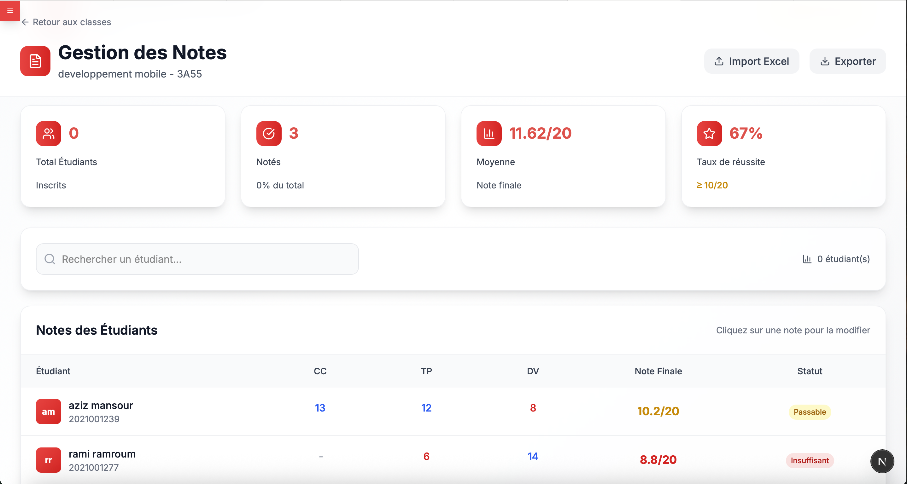

# Esprit Education Management System

A full-stack education management platform built with Next.js, TypeScript, and Supabase, featuring robust role-based access (Teacher/Admin), modern UI, Excel/PDF imports, and secure authentication.

> Internship project at Esprit University by Sayari Mohamed Amin. Encadrant: Ghassen Klai.

## ✨ Highlights

- Modern Next.js 15 + React 19 app with Tailwind CSS 4
- Clean Architecture (Domain, Application, Infrastructure, Presentation)
- JWT authentication with secure `auth_token` cookies
- Teacher and Admin roles with protected API routes and UI
- Students, Teachers, Classes, Subjects, Notes, Schedules modules
- Excel import/export for students and grades
- PDF schedule extraction (Python `pdfplumber`)
- Email-based password reset with verification codes (Gmail)
- Supabase as the database/storage layer

## 🧱 Tech Stack

- Framework: Next.js 15, React 19, TypeScript 5
- Styling: Tailwind CSS 4
- Auth: jose (JWT), httpOnly cookies
- DB/Storage: Supabase (`@supabase/supabase/supabase-js`)
- Email: Nodemailer (Gmail App Password)
- Files: Multer-like FormData handling in Next API routes
- Data import: `xlsx`
- Schedules: PDF parsing via Python (`pdfplumber`) executed from Node

## 🔐 Roles & Access

- Teacher
  - View/manage assigned classrooms and schedules
  - Manage assigned subjects and enter/update grades
  - Update profile photo
- Admin
  - All teacher features
  - Manage students, teachers (roles), classes, subjects, notes
  - Import/export students and notes
  - Access system-wide statistics

## 🖼️ Application Screenshots

### 🌟 Public Pages

<div align="center">
  <h3>🏠 Homepage</h3>
  
  
  <h3>🔐 Login Page</h3>
  
</div>

### 👨‍🏫 Teacher Dashboard

<div align="center">
  <h3>📚 Classroom Management</h3>
  
  
  <h3>📝 Notes Management</h3>
  
  
  <h3>📅 Schedule Management</h3>
  
  
  <h3>📊 Employment Management</h3>
  
  
  <h3>🎓 PFE Management</h3>
  
  
  <h3>👥 Student Management</h3>
  
  
  <h3>👤 Profile Page</h3>
  
  
  <h3>🧭 Teacher Navigation</h3>
  
</div>

### 👨‍💼 Admin Dashboard

<div align="center">
  <h3>🏢 Class Management</h3>
  
  
  <h3>👨‍🏫 Teacher Management</h3>
  
  
  <h3>📚 Subject Management</h3>
  
  
  <h3>👥 Student Management (Admin)</h3>
  
  
  <h3>🧭 Admin Navigation</h3>
  
</div>

### 🔧 Import/Export Features

<div align="center">
  <h3>📊 Excel Import - Students</h3>
  
  
  <h3>📄 PDF Import - Schedules</h3>
  
</div>

---

## ⚙️ Environment Variables

Create `.env.local` from the example below (or run: `cp .env.example .env.local`).

```bash
# Supabase
SUPABASE_URL="https://YOUR-PROJECT.supabase.co"
SUPABASE_KEY="YOUR_SERVICE_ROLE_OR_ANON_KEY"

# JWT
JWT_SECRET="change_me_in_production"

# Gmail (App Password required)
GMAIL_USER="your.address@gmail.com"
GMAIL_APP_PASSWORD="your_gmail_app_password"
```

Notes:
- `SUPABASE_KEY`: Prefer a restricted service role for server-side operations.
- JWT is used for signing/validating tokens (`src/infrastructure/services/JwtTokenService.ts`).

## 🚀 Getting Started

1) Install dependencies

```bash
npm install
```

2) Set up environment

```bash
cp .env.example .env.local
# Fill in values for Supabase, JWT, Gmail
```

3) (Optional) Set up Python virtualenv for PDF import

```bash
python3 -m venv venv
./venv/bin/pip install -r requirements.txt
# The app runs the script via ./venv/bin/python3 extract_schedule.py
```

4) Run the dev server

```bash
npm run dev
```

App will be available at http://localhost:3000

## 📦 NPM Scripts

- `npm run dev` - Start development server (Turbopack)
- `npm run build` - Build for production
- `npm run start` - Start production server
- `npm run lint` - ESLint

## 🧭 App Structure (Clean Architecture)

- `src/core` - Entities, value objects, and interfaces
- `src/application` - Use-cases and DTOs
- `src/infrastructure` - Supabase config, repositories, services (JWT, Email, Excel/PDF)
- `src/presentation` - UI components, pages, hooks
- `app` - Next.js App Router (UI routes and API routes)

## 🗄️ Database Model (Supabase)

- Teacher (`teacher`)
  - id, firstname, lastname, email (unique), departement, motdepasse (bcrypt), photo_url, role ('teacher'|'admin'), is_active, last_login, created_at, updated_at
- Student (`etudiant`)
  - id, firstname, lastname, email (unique), classe_id, numero_etudiant (unique), date_naissance, is_active, created_at, updated_at
- Class (`classe`)
  - id, nom_classe, bloc, numclasse, nbre_etudiant_max, nbre_etudiant_actuel
- Subject (`matiere`)
  - id, nommatiere, description, coefficient
- Teacher-Class-Subject (`teacher_classe`)
  - id, teacher_id, classe_id, matiere_id
- Notes (`note_finale`)
  - id, etudiant_id, matiere_id, teacher_id, note_cc, note_tp, note_dv, note_finale
- Note Config (`note_config`)
  - id, matiere_id, pourcentage_cc, pourcentage_tp, pourcentage_dv
- Password Reset (`password_reset_tokens`)
  - id, email, code, expires_at, is_used, created_at
- Schedule (`schedule`)
  - id, teacher_id, matiere_id, classe_id, schedule_date, week_start_date, start_time, end_time, session_type, notes, is_cancelled, created_at, updated_at

> All repository implementations use Supabase (`src/infrastructure/repositories/*`).

## 🔒 Security

- JWT auth with httpOnly cookies (`auth_token`)
- Middleware-protected routes (`middleware.ts` + `withAuth`/`withAdminAuth`)
- Strong password hashing (bcryptjs)
- DTO-based validation at API boundaries
- Parameterized queries via Supabase client

## 🔑 Authentication Flow

- Login: `POST /api/auth/login` → issues JWT, sets `auth_token` cookie (24h or 30d with remember me)
- Validate: `GET|POST /api/auth/validate` → validates token and returns teacher info
- Logout: `POST /api/auth/logout` → clears cookie
- Forgot Password: `POST /api/auth/forgot-password` → sends code by email
- Verify Reset Code: `POST /api/auth/verify-reset-code`
- Reset Password: `POST /api/auth/reset-password`

## 📚 API Endpoints (Implemented)

Authentication
- `POST /api/auth/login`
- `GET /api/auth/validate`
- `POST /api/auth/validate`
- `POST /api/auth/logout`
- `POST /api/auth/forgot-password`
- `POST /api/auth/verify-reset-code`
- `POST /api/auth/reset-password`

Teachers
- `GET /api/teachers` (auth)
- `POST /api/teachers` (auth) - create teacher (optional `role`)
- `POST /api/teachers/update-role` (admin)
- `POST /api/teachers/upload-photo` (auth)
- `GET /api/teachers/classes` (auth)

Students
- `GET /api/students?classeId=...` (auth)
- `POST /api/students` (auth)
- `POST /api/students/import-excel` (auth)
- `GET /api/students/import-excel` (auth) - format info

Classes & Subjects
- `GET /api/classes` (public list)
- `POST /api/classes` (auth) - assign class to authenticated teacher for a subject
- `GET /api/subjects` (public list)

Admin (role=admin)
- `GET /api/admin/classes`
- `POST /api/admin/classes/add`
- `GET /api/admin/students`
- `GET /api/admin/subjects`

Notes (Grades)
- `GET /api/notes/subjects` (auth, teacher's assignments)
- `GET /api/notes/students?matiereId=&classeId=` (auth)
- `PUT /api/notes/update` (auth) - single update
- `POST /api/notes/update` (auth) - batch update
- `GET /api/notes/export?matiereId=&classeId=&format=csv` (auth) - CSV download
- `POST /api/notes/import-excel` (auth)
- `GET /api/notes/import-excel/template?matiereId=&classeId=` (auth) - CSV template

Schedules
- `GET /api/schedule?type=week|date|teacher|class|subject|stats&...`
- `GET /api/schedule/[id]`
- `POST /api/schedule` - create schedule
- `POST /api/schedule/import-pdf` - extract events from PDF via Python
- `POST /api/schedule/import-schedules` (auth) - persist extracted data

## 🧩 UI Navigation

- Authenticated layout with role-based side navigation: `src/presentation/components/SideNavLayout.tsx`
- Pages under `app/(authenticated)/*`:
  - `/gestion-classroom`, `/gestion-emplois`, `/gestion-horraire` (teacher)
  - `/gestion-classes`, `/gestion-etudiants-admin`, `/gestion-matieres`, `/gestion-teachers` (admin)
- Login page: `app/login/page.tsx`

## 📥 Imports & Exports

- Students: Excel import (`POST /api/students/import-excel`)
- Notes: Excel import and CSV export
- Schedules: PDF import via `extract_schedule.py` (requires `venv` and `requirements.txt`)

## 📨 Email & Password Reset

- Uses Gmail via Nodemailer. Configure `GMAIL_USER` and `GMAIL_APP_PASSWORD` (App Password) in `.env.local`.
- Beautiful HTML email for verification code: `src/infrastructure/services/EmailService.ts`.

## 🔧 Configuration Notes

- Next config ignores type/ESLint errors on build (see `next.config.ts`). Use `npm run lint` during development.
- Auth cookie name: `auth_token` (httpOnly, secure in production, `sameSite=strict`).

## 🧪 Quick cURL Examples

Login
```bash
curl -X POST http://localhost:3000/api/auth/login \
  -H 'Content-Type: application/json' \
  -d '{"email":"teacher@esprit.tn","password":"secret","rememberMe":true}' \
  -i
```

Export Notes CSV
```bash
curl -G 'http://localhost:3000/api/notes/export' \
  --data-urlencode 'matiereId=1' \
  --data-urlencode 'classeId=2' \
  -H 'Cookie: auth_token=YOUR_TOKEN_HERE' -o notes.csv
```

## 🛡️ Production Checklist

- Set strong `JWT_SECRET`
- Use secure Supabase keys with least privilege
- Serve over HTTPS, `secure` cookies enabled
- Configure CI/CD and environment variables in the host

## 👤 Credits

- Developer: Sayari Mohamed Amin
- Encadrant: Ghassen Klai
- Institution: Esprit University

## 📄 License

MIT License.
